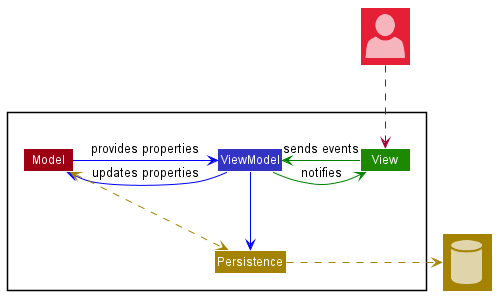
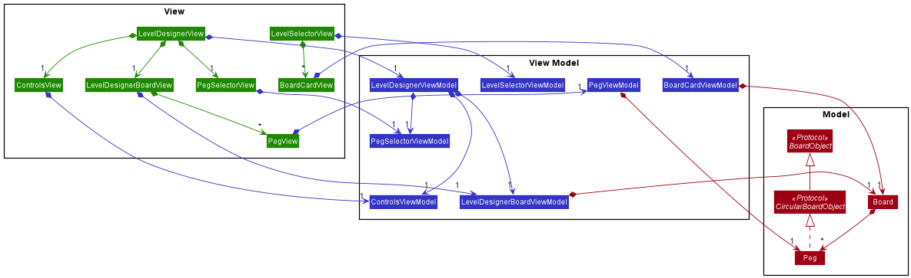
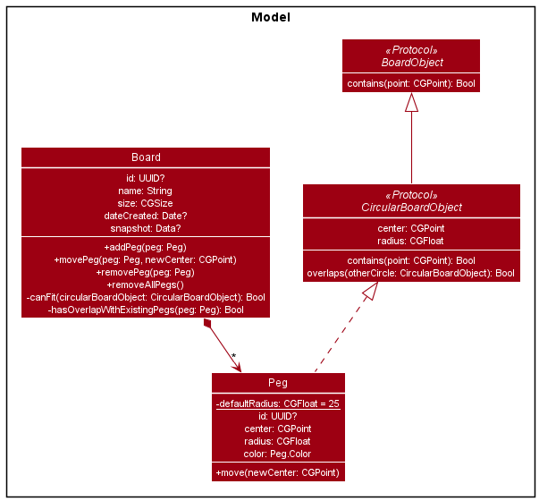
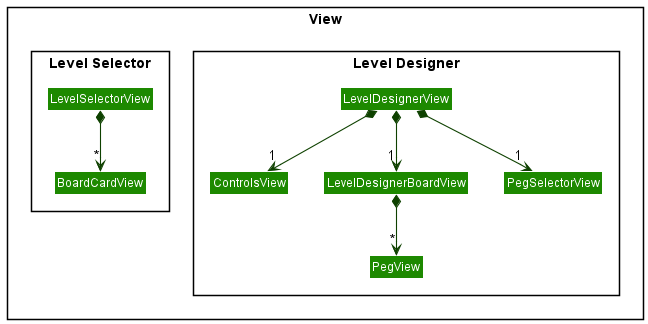
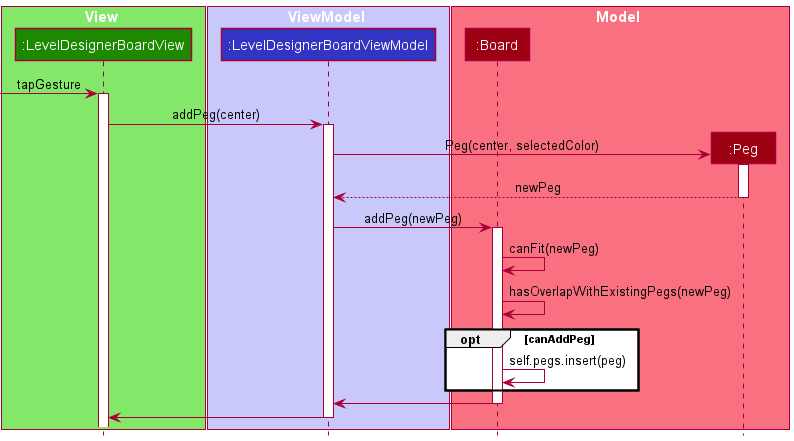

# Developer Guide

## Architecture

The architecture diagram above shows the high-level design of the application. The application
follows the Model-View-ViewModel design pattern.

The above class diagram shows how the different classes in the application interact. Note that
there are no dependencies from the models to the view models and no dependencies from the
view model to the view. This allows the models and view models to be tested independently.

### Model

- The model is responsible for representing the different objects in our application, as well as
  managing the operations that manipulate the state.
- The model manages the logic constraints, such as a board checking whether a peg overlaps with
  any of the other pegs.
- It is also responsible for serializing and deserializing the objects' representations to their
  in-memory representations.
- The model does not depend on any of the below components as they encapsulate the domain logic
  of the game. This allows the domain logic to be decoupled from the presentation logic.

### View Model

- The view model is responsible for holding the models as well as sending operations to update their
  properties.
- More importantly, the view model is also responsible for providing the data for the views to display.
  This includes converting the raw data to their presented form in the views, such as converting a
  level's creation date to something that is more meaningful to the user, for example duration elapsed since
  creation. Thus, views should not have any dependency on the models.
- The view model notifies the view whenever there is a change to the data so that the view can render
  these changes accordingly.

### View

- The view is responsible for handling user interactions such as touch gestures and handling text input.
- If there is dynamic data required to render the view, the data will be provided by its corresponding ViewModel
  (e.g. `PegView` relies on `PegViewModel` to provide the location, color and size of the peg.

The **Observer** pattern is used, where a view would observe changes in the view model to update its components.

### Persistence

- Responsible for persisting saved data.
  
## Interaction between layers

By following the MVVM design pattern, we make sure that the view only calls methods of the view model and the view
model only calls methods of the view, and never the other way round.

Below is an example of how the different layers interact when a user taps the board to place a peg.

