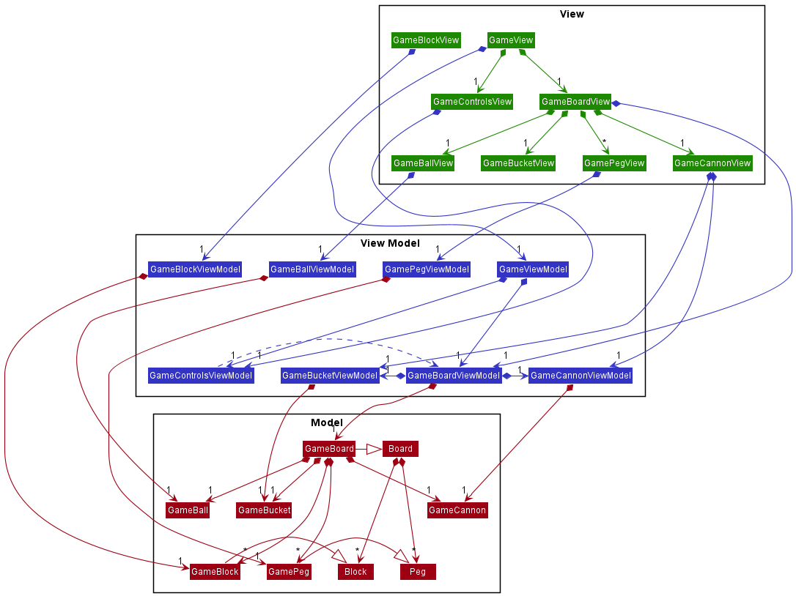

# Developer Guide

## Architecture

The architecture diagram above shows the high-level design of the application. The application
follows the Model-View-ViewModel design pattern. A point to note is that the Game Engine layer
wraps over the Model and View Model layers as both the Model and View Model layer contains
Peggle-specific logic.

The above class diagram shows how the game engine layer interacts with the physics engine layer. 
Note that there are no dependencies from the physics engine on the game engine. This allows for
the physics engine to be a standalone package from the rest of the application, allowing other
games to be built on the same physics engine.

### Renderer / View

- The views are responsible for rendering the placement and positions of the game objects.
- Graphical effects such as animating the removal of a peg are done within the view layer.
- The **Observer** pattern is used, where a view would observe changes in the view model to update its components.

### Game Engine

As mentioned above, the game engine consists of two layers, the Model and the View Model layer.

#### View Model

- The view model is responsible for holding the models as well as sending operations to update their
  properties.
- The view model notifies the view whenever there is a change to the data so that the view can render
  these changes accordingly.
- In the context of the game, the view model is responsible for managing the game loop. In each iteration
of the game loop, the view model will invoke methods of the model that will update the state of the game 
board and the game objects in the game board.

#### Model

- The model is responsible for representing the different objects in our application, as well as
  managing the operations that manipulate the state.
- The model also stores the physics-related properties of the game objects, such as the position, velocity,
mass and acceleration.
- Classes that are to obey the laws of physics will have to conform to the underlying `PhysicsEngine` protocol.
  - For example, the `GameBoard` conforms to the `PhysicsWorld` protocol and the `GameBall` and `GamePeg` conforms
  to the `PhysicsBody` protocol.
- Applications of powerups in the game boards follow the Command pattern.
  
The below image shows the full Model-View-ViewModel class diagram, excluding the relationships with
the Physics Engine which have already been shown [earlier](#physicsengineinteraction).

### Physics Engine

The physics engine is designed to be an independent package from the rest of the application so as to allow
other applications to be built on top of it. Therefore, the physics engine layer does not depend on any of
the other layers above.

- The physics engine is responsible for simulating physics interactions between objects, including behaviour such
as object movement and collisions.
- A `PhysicsWorld` is a two-dimensional environment that contains any number of `PhysicsBody`s. The `PhysicsWorld`
is responsible for applying gravitational forces on the `PhysicsBody`s, detecting and resolving collisions among
`PhysicsBody`s as well as keeping the `PhysicsBody`s within unpassable boundaries.
- A `PhysicsBody` is an object within a `PhysicsWorld` that exhibits physics properties. It contains the most
fundamental physics scalars and vectors such as mass, velocity and acceleration. It is also the base class
of all physics bodies which can be of different geometrical shapes.
  - For example, for triangular physics bodies, a `TriangularPhysicsBody` protocol which extends the `PhysicsBody`
  protocol can be created.
  
Refer to the [above diagram](#physicsengineinteraction) for the classes and relationships in the physics engine.

## Game Loop

The game loop is currently handled by the [`CADisplayLink`](https://developer.apple.com/documentation/quartzcore/cadisplaylink)
which is a property of the `GameBoardViewModel`.

This image depicts the operations that are carried out within one iteration of the game loop.

## Future improvements

- Implement more efficient collision detection
  - Currently, collisions are detected by doing a naive `overlaps` check for all distinct pairs of physics bodies,
    giving rise to a `O(n^2)` time complexity, where n represents the number of physics bodies in the physics world
  - See the [broad phase-narrow phase collision detection algorithm](https://www.toptal.com/game/video-game-physics-part-ii-collision-detection-for-solid-objects),
    which reduces the time complexity to `O(nlogn)`
